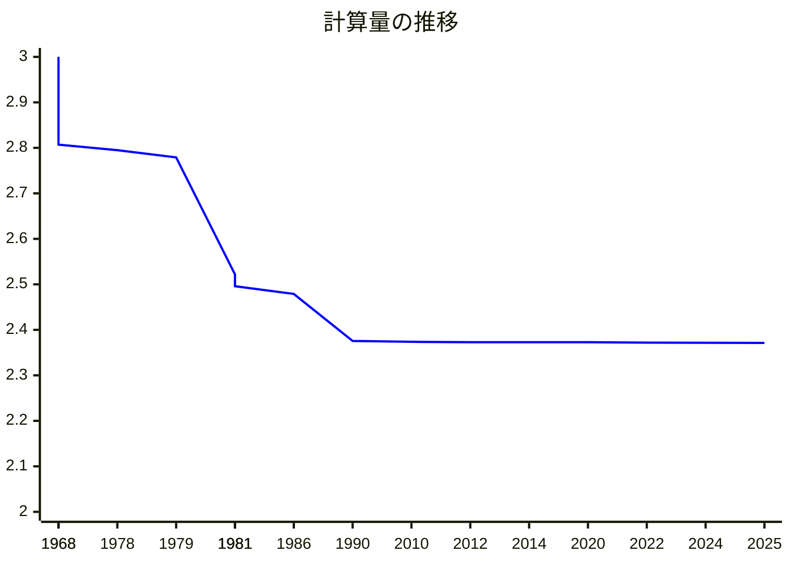
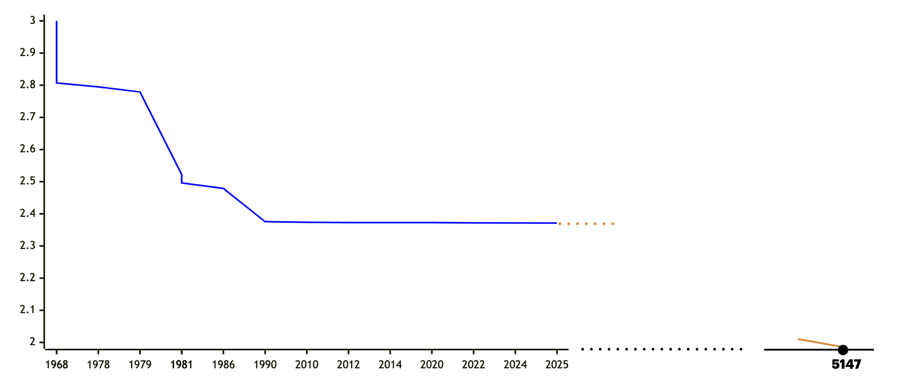

# 行列積アルゴリズムの誤り訂正

[清水 伸高](https://sites.google.com/view/nobutaka-shimizu/home) (東京科学大学)

2025年8月18日, JCCA2025@広島

---
layout: top-title
color: amber-light
---

::title::

# トークの内容

::content::

平原 秀一さん(NII)との二つの共著論文をマージした内容
- Error-Correction of Matrix Multiplication Algorithms (STOC'25)
- An Optimal Error-Correcting Reduction for Matrix Multiplication (ICALP'25)

<v-clicks>

- 「行列積の近似アルゴリズムと厳密アルゴリズムの等価性を**誤り訂正符号**を使って示した」という論文
- 2025年のSTOCとICALPに採択
  - **STOC (Symposium on Theory of Computing)**: 理論計算機科学の最高難易度の国際会議
  - 組合せ論の計算量理論(の周辺)への応用に関する論文がとても多い
    - キーワード: 擬似ランダムネス, 誤り訂正符号, エクスパンダー, 加法的組合せ論, etc
</v-clicks>

---
layout: top-title
color: amber-light
---

::title::

# 行列積

::content::

入力として与えられた二つの行列$A,B\in\mathbb{F}^{n\times n}$に対して$AB$を計算せよ ($\mathbb{F}$は有限体).

行列積の計算量を$O(n^\omega)$とする

| 年 | $\omega$ | 論文 |
|:--:|:--|:--|
| 1968 | $2.807$ | [Strassen](https://link.springer.com/article/10.1007/BF02165411) |
| 1978 | $2.795$ | [Pan](https://ieeexplore.ieee.org/document/4567976) |
| 1979 | $2.779$ | [Bini, Capovani, Romani, Lotti](https://www.sciencedirect.com/science/article/pii/0020019079901133) |
| 1981 | $2.522$ | [Schönhage](https://epubs.siam.org/doi/10.1137/0210032) |
| 1981 | $2.517$ | [Romani](https://epubs.siam.org/doi/10.1137/0211020) |

| 年 | $\omega$ | 論文 |
|:--:|:--|:--|
| 1981 | $2.496$ | [Coppersmith, Winograd](https://ieeexplore.ieee.org/document/4568320) |
| 1986 | $2.479$ | [Strassen](https://ieeexplore.ieee.org/document/4568194) |
| **1990** | $2.3755$ | [Coppersmith, Winograd](https://www.sciencedirect.com/science/article/pii/S0747717108800132?via%3Dihub) |
| 2010 | $2.3737$ | [Stothers](https://era.ed.ac.uk/handle/1842/4734) |
| 2012 | $2.3729$ | [Williams](https://dl.acm.org/doi/10.1145/2213977.2214056) |

| 年 | $\omega$ | 論文 |
|:--:|:--|:--|
| 2014 | $2.3728639$ | [Le Gall](https://dl.acm.org/doi/10.1145/2608628.2627493) |
| 2020 | $2.3728596$ | [Alman, Williams](https://theoretics.episciences.org/14213) |
| 2022 | $2.371866$ | [Duan, Wu, Zhou](https://ieeexplore.ieee.org/document/10353208) |
| 2024 | $2.371552$ | [Williams, Xu, Xu, and Zhou](https://epubs.siam.org/doi/10.1137/1.9781611977912.134) |
| **2025** | $2.371339$ | [Alman, Duan, Williams, Xu, Xu, and Zhou](https://epubs.siam.org/doi/10.1137/1.9781611978322.63) |

---
layout: top-title
color: amber-light
---

::title::

# 行列積の計算量の推移

::content::

 この35年で0.0046しか改善していない 

 

---
layout: top-title
color: amber-light
---

::title::

# 行列積の計算量の推移

::content::

<figure>

<figcaption style="text-align: center; font-size: 0.8em; color: #666;">

0.0046 / 35年 の改善率が持続すると, $O(n^2)$時間まであと3122年かかる. とても難しい問題.

</figcaption>
</figure>

---
layout: top-title
color: amber-light
---

::title::

# 行列積の近似

::content::

入力として与えられた二つの**一様ランダム**な行列 $A,B\sim\mathbb{F}^{n\times n}$ に対して, 行列$C\in\mathbb{F}^{n\times n}$であって,
$AB$と $\textcolor{c2185b}{\alpha \cdot n^2}$個の成分が一致するものを(何でもよいので)計算せよ.

<v-clicks>

- $\alpha = 1$は通常の(平均時)行列積
- $\alpha = \frac{1}{\abs{\F}}$なら簡単 (ランダムな行列を出力すればよい)
- 「非自明なアルゴリズム」: $\alpha \ge \frac{1}{\abs{\F}} + \varepsilon$ を達成
- 本発表: 常に$|\F|$は定数 ($\F$上の算術演算の計算量は無視).

$n^{2+o(1)}$時間で非自明な$\alpha$を達成できるか?

</v-clicks>

---
layout: top-title
color: amber-light
---

::title::

# 動機

::content::

- 高速行列積の多くのアルゴリズムは非実用的
  - 定数倍が非常に大きい ($n>10^{155}$じゃないとStrassenより早くならない <a href="https://epubs.siam.org/doi/10.1137/1.9781611978322.61" class="cite-reference">\[Alman, Yu, 2025\]</a>)

<v-clicks>

- AI技術の多くがGPU上で大規模な行列積（例えば勾配計算）に依存するため、電力消費量が世界的に増加傾向にある <a class="cite-reference" href="https://www.iea.org/reports/electricity-2024/executive-summary"> \[International Energy Agency\] </a>

- 近年, 物理系を利用した**省エネ**行列積アルゴリズムが提案されている: 
  - 水流 <a href="https://drops.dagstuhl.de/entities/document/10.4230/LIPIcs.ITCS.2024.96" class="cite-reference">\[Valinat, 2024\]</a>
  - 熱力学系 <a href="https://openreview.net/forum?id=6flkWTzK2H" class="cite-reference">\[Coles et al, 2023\]</a>
  - 光学デバイス <a href = "https://www.nature.com/articles/s41377-022-00717-8" class="cite-reference">\[Zhou et al, 2022\]</a>

- 物理系に依拠するアルゴリズムはホワイトノイズによるエラーが発生しうる (つまり近似行列積を解いてる)

成果: このような誤り訂正を**エクスパンダーグラフ**を使って解決😄 (ただし有限体上)

</v-clicks>

---
layout: top-title
color: amber-light
---

::title::

# 問題設定

::content::

二つの行列$C,D\in \mathbb{F}^{n\times n}$の**一致率** $\agr(C,D)$を以下で定義する:

$$
  \begin{align*}
    \agr(C,D) &:= \Pr_{i,j\sim[n]}[C(i,j) = D(i,j)]
  \end{align*}
$$

アルゴリズム$M$は以下を満たすとき, **平均一致率**$\alpha$をもつという:

$$
  \begin{align*}
    \Exp_{\substack{A,B\sim\Fp^{n\times n}}}[\agr(M(A,B),AB)] &\ge \alpha
  \end{align*}
$$

<v-clicks>

- $\alpha=1$のとき, 任意の入力$A,B\in\F^{n\times n}$に対し, 全成分を計算している
- $\alpha=\frac{1}{|\F|}$のときは簡単 (ランダム行列を出力)

</v-clicks>

---
layout: top-title
color: amber-light
---
::title::

# 主結果

::content::

任意の定数$\varepsilon>0$に対し, もし平均一致率 $\textcolor{c2185b}{\alpha\ge \frac{1}{\abs{\F}}+\varepsilon}$ をもつ$\textcolor{c2185b}{T(n)}$時間アルゴリズム$M$が存在するならば, 平均一致率$1$をもつ$\textcolor{c2185b}{T(n)\cdot (\log n)^{O(1)}}$ 時間乱択アルゴリズム$M'$が存在する. 具体的には

$$

\forall A,B\in\F^{n\times n},\quad \Pr_{M'}\left[ M'(A,B) = AB \right] \ge \frac{2}{3}.

$$

<v-clicks>

- 非自明な$\alpha$を達成する高速なアルゴリズムが作れたら, 行列積に対する高速なアルゴリズムが作れる
- <a class="cite-reference" href="https://drops.dagstuhl.de/entities/document/10.4230/LIPIcs.APPROX/RANDOM.2024.34">\[Gola, Shinkar, Singh, RANDOM'24\]</a> の未解決問題を肯定的に解決!
- **平均時から最悪時への帰着**: ランダムな入力解ける $\Rightarrow$ 任意の入力で解ける
- $\varepsilon>0$に対する依存度は大きい: $M'$の計算量は$\textcolor{c2185b}{2^{2^{\poly(1/\varepsilon)}}}\cdot T(n) \cdot (\log n)^{O(1)}$

</v-clicks>

---
layout: top-title
color: amber-light
---

::title::

# 関連結果

::content::

- <a class="cite-reference" href="https://drops.dagstuhl.de/entities/document/10.4230/LIPIcs.APPROX/RANDOM.2024.34">\[Gola, Shinkar, Singh, RANDOM'24\]</a>
  - この問題設定を初めて考えた論文
  - $\alpha>\frac{8}{9}$が達成可能$\Rightarrow$ $\alpha=1$を達成可能 ($\alpha\ge\frac{1}{\abs{\F}}+\varepsilon$にできるかはopen question)

<v-clicks>

- 行列積(全成分の計算)に対する最悪時から平均時への帰着
  - <a href="https://www.sciencedirect.com/science/article/pii/002200009390044W?via%3Dihub" class="cite-reference">\[Blum, Luby, Rubinfeld, JCSS'93\]</a>
  - <a href="https://dl.acm.org/doi/10.1145/3519935.3520041" class="cite-reference">\[Asadi, Golovnev, Gur, Shinkar, STOC'22\]</a>
  - <a href="https://dl.acm.org/doi/10.1145/3564246.3585189" class="cite-reference">\[Hirahara, Shimizu, STOC'23\]</a>
  
- 後続研究: $\varepsilon$への依存度の改善
  - <a class="cite-reference" href="https://arxiv.org/abs/2502.13065">\[Vaikuntanathan, Zamir, '25\]</a> (ただし, Learning with Parityの計算量的困難性に依拠)
  - \[Shinkar, Singh, RANDOM'25]: 我々の$2^{2^{\poly(1/\varepsilon)}}$を$2^{\poly(1/\varepsilon)}$に改善

</v-clicks>

---
layout: top-title
color: amber-light
---

::title::

# アイデア: 行列の符号化

::content::

任意の$A,B\in\F^{n\times n}$に対して$\agr(M(A,B),AB)\ge \alpha$であるとする (最悪時の設定)

<v-click>

ポイント: **誤り訂正符号**を使ってencoding/decodingを設計

</v-click>

---
layout: section
color: amber-light
---

# アルゴリズム的誤り訂正符号の入門

---
layout: top-title
color: amber-light
---

::title::

# 符号の基礎

::content::

- ある行列$L\in\F^{N\times n}$に対し, $\Enc\colon z\mapsto Lz$と書ける関数を**符号化関数**という
  - ある符号化関数に対し, $\calC = \Enc(\F^n)$を **(線形)符号** という
  - 常に$N>n$ ($\Enc(z)$は$z$に冗長性を付与する写像)

    

- ベクトル同士の距離: $\dist(x,y) = \frac{1}{n}\sum_{i\in[n]} \mathbf{1}_{x(i)\ne y(i)}$ (ハミング距離)
  - $\ball(x,\rho)$ : 半径$\rho$, 中心$x$のハミングボール
- 符号$\calC$の距離: $\delta := \min_{\substack{x\ne y \\x,y\in \calC}}\dist(x,y)$

---
layout: top-title
color: amber-light
---

::title::

# 符号の基礎 (一意復号)

::content::

符号$\calC$は, 任意の$y\in\F^N$に対して

$$
  \abs{\ball(y,\rho)\cap \calC} \le 1
$$

であるとき, **半径$\rho$で一意復号可能である**という.

<figcaption style="text-align: center; font-size: 0.8em; color: #666;">

メッセージ$x$を符号化して$y=\Enc(x)$を送信すれば, 
たとえ$y$に小さいノイズが乗って$\widetilde{y}$を受信したとしても
$x$が復元できる.

</figcaption>

---
layout: top-title
color: amber-light
---

::title::

# 符号の基礎 (一意復号の限界)

::content::

- 符号の距離が$\delta$であるとき, $\rho\le \delta/2$でなければならない
  - 特に, 訂正できるエラーの割合は$\rho \le 1/2$

- 50\%を超えるエラーを一意復号するのは不可能
  - 復号の一意性を緩めることによって対処できるか? -> リスト復号

<figcaption style="text-align: center; font-size: 0.8em; color: #666;">

半径$\rho$で一意復号可能な符号を作るには, 半径$\rho$のHammingボールを$\F^n$内に敷き詰めればよい.

</figcaption>

---
layout: top-title
color: amber-light
---

::title::

# 符号の基礎 (リスト復号)

::content::

任意の$y\in\F^N$に対し, $\ball(y,\rho)\cap \calC$ の要素数が小さい符号$\calC$を**リスト復号可能**という.

符号$\calC\subseteq \F^N$ は, 全ての$y\in \F^N$に対して

$$

\abs{\ball(y,\rho)\cap \calC} \le L

$$

を満たすとき, **リストサイズ$L$で$\rho$-リスト復号可能である**という.

  

- 50\%を超えるエラーも復元できるようになる!

---
layout: top-title
color: amber-light
---
::title::

# 符号の基礎 (リスト復号の限界)

::content::

- 半径$\rho$とリストサイズ$L$にはトレードオフがある
  - 特に$L=O(1)$ ($n$に依存しない定数) となる最大の$\rho$に興味がある.

  

<v-clicks>

- 事実: レートが十分小さいランダムな線形符号を考えれば, $\delta\approx 1-\frac{1}{|\F|}$であり, whpで
  - $\rho \le \frac{\delta}{2}-\varepsilon$ならば一意復号可能
  - $\rho \le \delta - \varepsilon$ならばリスト復号可能

- ランダムな符号を考えれば, 大体の場合は最適なパラメータを達成 (例外あり)

</v-clicks>

---
layout: top-title
color: amber-light
---

::title::

# アルゴリズム的側面

::content::

- リスト復号アルゴリズム: $y\in \F^N$を入力として受け取り, $\dist(y,\Enc(x))\le \rho$を満たす$x$を**全て**出力
  - 元の符号がリスト復号可能なら, 答えは全部で$L$個
- 自明な指数時間アルゴリズム: 全ての$x$を列挙して$\dist(\Enc(x),y)\le \rho$かチェック

<v-clicks>

最適なパラメータおよび構造的性質をもち, 効率的にリスト復号できる符号があるか?
  1. 距離:$\delta\approx 1-\frac{1}{|\F|}$
  2. リスト可能半径 $\rho\approx \delta\approx 1-\frac{1}{|\F|}$
  3. 構造的性質を持ち, 効率的にリスト復号可能な符号

-> **エクスパンダーウォーク符号** <a href="https://dl.acm.org/doi/10.1145/3055399.3055408" class="cite-reference">\[Ta-Shma, 2017\]</a>

</v-clicks>

---
layout: section
color: amber-light
---

# 行列の符号化

---
layout: top-title
color: amber-light
---
::title::
# エクスパンダーグラフに基づく符号
::content::

グラフ$G=(V,E)$を$d$-正則**エクスパンダーグラフ**とする.
パラメータ$W\subseteq V^\ell$を, $G$上の長さ$\ell-1$のウォークの全体とする ($\abs{W}=n\cdot d^{\ell}$).

以下の符号化関数$\Enc\colon \F^V\to\F^W$で定まる符号を**エクスパンダーウォーク符号**という:

$$
  \Enc(x) = \rbra{ x(v_0)+x(v_1)+\dots+x(v_{\ell-1}) }_{(v_0,v_1,\dots,v_{\ell-1})\in W }
$$

<figcaption style="text-align: center; font-size: 0.8em; color: #666;">

長さ$2$のウォークが辿った頂点の値を足し合わせる

</figcaption>

---
layout: top-title
color: amber-light
---
::title::
# エクスパンダーグラフに基づく符号
::content::

グラフ$G=(V,E)$を$d$-正則**エクスパンダーグラフ**とする.
パラメータ$W\subseteq V^\ell$を, $G$上の長さ$\ell-1$のウォークの全体とする ($\abs{W}=n\cdot d^{\ell}$).

以下の符号化関数$\Enc\colon \F^V\to\F^W$で定まる符号を**エクスパンダーウォーク符号**という:

$$
  \Enc(x) = \rbra{ x(v_0)+x(v_1)+\dots+x(v_{\ell-1}) }_{(v_0,v_1,\dots,v_{\ell-1})\in W }
$$

<figcaption style="text-align: center; font-size: 0.8em; color: #666;">

長さ$2$のウォークが辿った頂点の値を足し合わせる

</figcaption>

---
layout: top-title
color: amber-light
---
::title::

# エクスパンダーウォーク符号の性質

::content::

- $\Enc\colon \F^V \to \F^W$ をエクスパンダーウォーク符号とする

<v-clicks>  

- グラフの次数$d$の歩数$\ell$が定数ならば, **レートは$\Omega(1)$**

- 任意の定数 $\varepsilon>0$ に対し, **半径 $\rho=1-\frac{1}{\abs{\F}}-\varepsilon$** で 「近似」リスト復号が可能 <a href="https://drops.dagstuhl.de/entities/document/10.4230/LIPIcs.APPROX/RANDOM.2023.60" class="cite-reference">\[Jeronimo, RANDOM'23\]</a>
  - 計算時間は$2^{2^{\poly(1/\varepsilon)}}\cdot |V|(\log |V|)^{O(1)}$
  - $\varepsilon$への依存度は大きい (Frieze-Kannanの弱正則化補題)
- 符号化 $z \mapsto \Enc(z)$ の計算も$O(|V|)$時間でできる

行列積に対するencocding/decodingとして使える

- (符号化と復号化はほぼ線形時間でなければならない)

</v-clicks>

---
layout: top-title
color: amber-light
---

::title::
# 帰着の全体図
::content::

行列$A,B\in\F^{n\times n}$に対し, うまく$A',B'$を構成して
$A'B'=\Enc(AB)$となるようにしたい.

---
layout: top-title
color: amber-light
---
::title::
# 行列$A',B'$の構成
::content::

<figcaption style="text-align: center; font-size: 0.8em; color: #666;">

行列$A'$は$\abs{W}\times kn$行列となる. 第$\mathbf{i}=(i_1,\dots,i_k)$行目には, $A$の第$i_1$行ベクトル, 第$i_2$行ベクトル, ... を並べる.
 
$B'$は$B$に対し, 行と列を入れ替えて同じ操作を行って構成する.

</figcaption>

---
layout: top-title
color: amber-light
---
::title::
# 行列$A',B'$の構成
::content::

- $A'B' \in \F^{W\times W}$の第$(\mathbf{i},\mathbf{j})$成分は, $(AB)_{i_1,j_1} + \dots + (AB)_{i_k,j_k}$に一致する ($\mathbf{i},\mathbf{j}$は$G$上のウォーク)
- これは, テンソル積$G^2$上のウォーク$(i_1,j_1)\to \dots \to (i_k,j_k)$に沿った和とみなせる.
- すなわち, $AB$を, **$G^2$上のエクスパンダーウォーク符号**で符号化したものとみなせる.

---
layout: top-title
color: amber-light
---
::title::

# まとめ

::content::

- 行列積に対する近似アルゴリズムが設計できたら, ほぼ同程度の時間で全成分を計算する行列積アルゴリズムが構成できる
- 証明手法: 誤り訂正符号のリスト復号を行列に適用
  - **エクスパンダーウォーク符号** + 近似リスト復号アルゴリズム
- **体が大きい時**でも別の符号を使えば同様の結果を示せる
  - 例: $\abs{\F} \ge n/\alpha$のとき, リードソロモン符号+テンソル符号 <a href="https://dl.acm.org/doi/10.1145/3717823.3718244" class="cite-reference">\[Hirahara, Shimizu, STOC'25\]</a>
- 今後の方向性
  - **実数**上の行列積で同様のことができないか? (実用的には実数上の行列積が主流のはず)
  - $\varepsilon$への依存度の改善 (後続研究で改善)